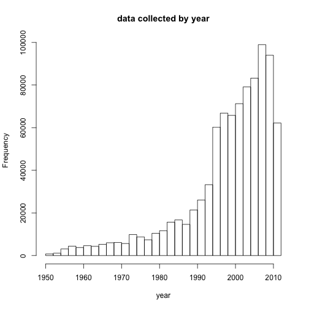
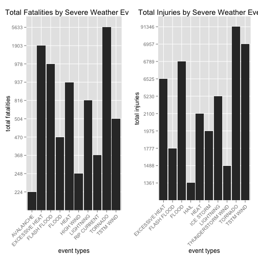
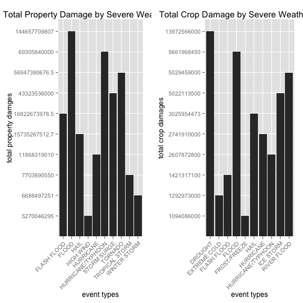

---
title: "Analysis on the Effect of Severe Weather Events on Public Health and Economy in the United States"
author: "Hetian Chen"
date: "Aug 3, 2015"
---

## Synopsis
The goal of this analysis is to explore the relationship between severe weather events with public heath and economy. The data are collected from U.S. National Oceanic and Atmospheric Administration's (NOAA) storm database from 1950 to 2011. According to the analysis, tornado is most harmful with respect to population health. Besides, flood and drought have the worest economic consequences.

## Data Processing
1. read data into dataframe 

```r
bunzip2("repdata-data-StormData.csv.bz2",overwrite=T,remove=F)
```

```
## Error in eval(expr, envir, enclos): could not find function "bunzip2"
```

```r
data = read.csv(file = "repdata-data-StormData.csv",stringsAsFactors = FALSE)
dim(data)
```

```
## [1] 902297     37
```
There're 902297 rows and 37 columns in the file. The first two rows are shown below.

```r
head(data,n=2)
```

```
##   STATE__          BGN_DATE BGN_TIME TIME_ZONE COUNTY COUNTYNAME STATE
## 1       1 4/18/1950 0:00:00     0130       CST     97     MOBILE    AL
## 2       1 4/18/1950 0:00:00     0145       CST      3    BALDWIN    AL
##    EVTYPE BGN_RANGE BGN_AZI BGN_LOCATI END_DATE END_TIME COUNTY_END
## 1 TORNADO         0                                               0
## 2 TORNADO         0                                               0
##   COUNTYENDN END_RANGE END_AZI END_LOCATI LENGTH WIDTH F MAG FATALITIES
## 1         NA         0                        14   100 3   0          0
## 2         NA         0                         2   150 2   0          0
##   INJURIES PROPDMG PROPDMGEXP CROPDMG CROPDMGEXP WFO STATEOFFIC ZONENAMES
## 1       15    25.0          K       0                                    
## 2        0     2.5          K       0                                    
##   LATITUDE LONGITUDE LATITUDE_E LONGITUDE_ REMARKS REFNUM
## 1     3040      8812       3051       8806              1
## 2     3042      8755          0          0              2
```
2. explore the distribution of data collected in year.

```r
data$year <- as.numeric(format(as.Date(data$BGN_DATE, format = "%m/%d/%Y %H:%M:%S"), "%Y"))
hist(data$year, breaks = 40, xlab = "year", main = "data collected by year")
```

 

## Results
1.Which types of events (as indicated in the EVTYPE variable) are most harmful with respect to population health?

```r
library(gridExtra)
library(ggplot2)
aggTotal_fatality = aggregate(FATALITIES~EVTYPE,data, FUN = sum,na.action= na.omit)
aggTotal_fatality = aggTotal_fatality[with(aggTotal_fatality,order(-FATALITIES)),]
aggTotal_fatality = aggTotal_fatality[1:10,]

aggTotal_injury= aggregate(INJURIES~EVTYPE, data,FUN = sum,na.action= na.omit)
aggTotal_injury = aggTotal_injury[with(aggTotal_injury,order(-INJURIES)),]
aggTotal_injury = aggTotal_injury[1:10,]

p1 = ggplot(aggTotal_fatality,aes(factor(EVTYPE),factor(FATALITIES))) + geom_bar(stat="identity")+
  ggtitle("Total Fatalities by Severe Weather Events")+
  xlab( "event types")+ylab("total fatalities")+
  theme(axis.text.x = element_text(angle = 45, hjust = 1))

p2 = ggplot(aggTotal_injury,aes(factor(EVTYPE),factor(INJURIES))) + geom_bar(stat="identity")+
  ggtitle("Total Injuries by Severe Weather Events")+
  xlab( "event types")+ylab("total injuries")+
  theme(axis.text.x = element_text(angle = 45, hjust = 1))
grid.arrange(p1,p2,ncol=2)
```

 

To focus on most promising results, we just show the top 10 events related with fatality and injury. As we can se from the bar plot, Tornado causes the most fatality and injury from 1950 to 2011 in US.

2. Which types of events have the greatest economic consequences?


```r
library(gridExtra)
library(ggplot2)
# compute numerical property damage and crop damage
converter <- function(dataset = storm, fieldName, newFieldName) {
    totalLen <- dim(dataset)[2]
    index <- which(colnames(dataset) == fieldName)
    dataset[, index] <- as.character(dataset[, index])
    logic <- !is.na(toupper(dataset[, index]))
    dataset[logic & toupper(dataset[, index]) == "B", index] <- "9"
    dataset[logic & toupper(dataset[, index]) == "M", index] <- "6"
    dataset[logic & toupper(dataset[, index]) == "K", index] <- "3"
    dataset[logic & toupper(dataset[, index]) == "H", index] <- "2"
    dataset[logic & toupper(dataset[, index]) == "", index] <- "0"
    dataset[, index] <- as.numeric(dataset[, index])
    dataset[is.na(dataset[, index]), index] <- 0
    dataset <- cbind(dataset, dataset[, index - 1] * 10^dataset[, index])
    names(dataset)[totalLen + 1] <- newFieldName
    return(dataset)
}
data <- converter(data, "PROPDMGEXP", "propertyDamage")
data <- converter(data, "CROPDMGEXP", "cropDamage")
options(scipen=999)

aggTotal_property = aggregate(propertyDamage~EVTYPE,data, FUN = sum,na.action= na.omit)
aggTotal_property = aggTotal_property[with(aggTotal_property,order(-propertyDamage)),]
aggTotal_property = aggTotal_property[1:10,]

aggTotal_crop= aggregate(cropDamage~EVTYPE, data,FUN = sum,na.action= na.omit)
aggTotal_crop = aggTotal_crop[with(aggTotal_crop,order(-cropDamage)),]
aggTotal_crop = aggTotal_crop[1:10,]

p3 = ggplot(aggTotal_property,aes(factor(EVTYPE),factor(propertyDamage))) + geom_bar(stat="identity")+
  ggtitle("Total Property Damage by Severe Weather Events")+
  xlab( "event types")+ylab("total property damges")+
  theme(axis.text.x = element_text(angle = 45, hjust = 1))

p4 = ggplot(aggTotal_crop,aes(factor(EVTYPE),factor(cropDamage))) + geom_bar(stat="identity")+
  ggtitle("Total Crop Damage by Severe Weather Events")+
  xlab( "event types")+ylab("total crop damages")+
  theme(axis.text.x = element_text(angle = 45, hjust = 1))
grid.arrange(p3,p4,ncol=2)
```

 

To focus on most promising results, we just show the top 10 events related with property damage and crop damage. As we can se from the bar plot, flood causes the most property damage and drought causes the most crop damage from 1950 to 2011 in US.


